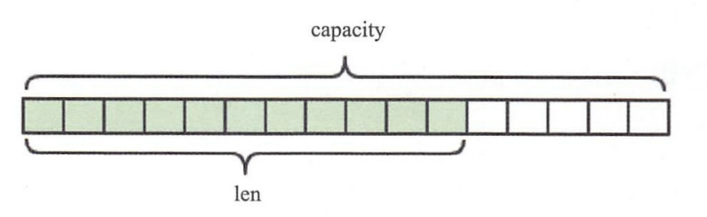
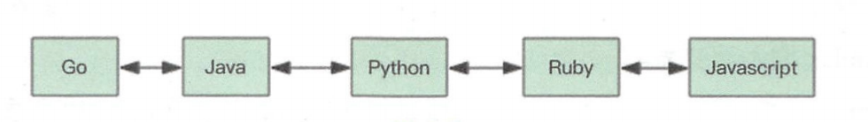

## Redis 远程字典服务(Remote Dicitory Service)

### 1、要体验Redis，我们先从Redis的安装说起

##### 1.1、Redis的安装主要有三种方式

> 1、使用Docker安装
>
> 2、通过github源码编译
>
> 3、直接安装apt-get install（Ubuntu）、yum install（Redhat）、或者brew install（Mac）

###### 1.1.1、Docker方式

```shell
# 拉取docker镜像
> docker pull redis
# 运行docker容器
> docker run --name myredis -d -p6379:6379 redis
# 执行docker容器中的redis-cli，可以直接使用命令行操作Redis
> docker exec -it myredis redis-cli
```

###### 1.1.2、Github源码编译方式

```shell
# 下载源码
> git clone --branch 2.8 --depth 1 git@github.com:antirez/redis.git
> cd redis
# 编译
> make
> cd src
# 运行服务器，daemonize标识在后台运行
> ./redis-server --daemonize yes
# 运行命令行
> ./redis-cli
```

###### 1.1.3、直接安装方式

```shell
# mac
> brew install redis
# ubuntu
> apt-get install redis
# redhat
> yum install redis
# 运行客户端
> redis-cli
```


### 2、5种数据结构

​		Redis有5中基础数据结构，分别为：string（字符串）、list（列表）、hash（字典）、set（集合）和zset（有序集合）。这5中基本数据结构是Redis的相关知识中最基础、最重要的部分。

##### 2.1、string（字符串）

​		字符串string是Redis最简单的数据结构，它的内部标识就是一个字符数组。Redis所有的数据结构都以唯一的key字符串作为名称，然后通过这个唯一key值来获取相应的value数据。不同类型的数据结构的差异就在于value的结构不一样。

​		Redis的字符串是动态字符串，是可以修改的字符串，内部结构的实现类似于Java的ArrayList，采用预分配冗余空间的方式来减少内存的频繁分配，如图所示，内部为当前字符串分配的实际空间capacity一般要高于实际字符串长度len。当字符串长度小于1MB时，扩容都是加倍现有的空间。如果字符串长度超过1MB，扩容时一次只会多扩1MB的空间。<font color= "blue">需要注意的是字符串最大长度为512MB。</font>



<font color = "tomato">【键值对】</font>

​		相当于字典的key和value，支持简单的增删改查操作。下面代码中的”name“就是字典的key，而value就是字符串”codehole“。

```shell
> set name codehole
OK
> get name
"codehole"
> exists name
(integer) 1
> del name
(integer) 1
> get name
(nil)
```

<font color = "tomato">【批量键值对】</font>

​		可以对多个字符串进行批量读写，节省网络耗时开销。

```shell
> set name1 codehole
OK
> set name2 holycoder
OK
> mget name1 name2 name3  # 返回一个列表
1) "codehole"
2) "holycoder"
3) (nil)
> mset name1 boy name2 girl name3 unknown
> mget name1 name2 name2
1) "boy"
2) "girl"
3) "unknown"
```

<font color = "tomato">【过期和set命令扩展】</font>

​		可以对key设置过期时间，到时间会被自动删除，这个功能常用来控制缓存的失效时间。

```shell
> set name codehole
> get name
"codehole"
> expire name 5   # 5s 后过期
...   # 等候5s
> get name
(nil)

> setex name 5 codehole   # 5s后过期，等价于set + expire
> get name
"codehole"
...   # 等候5s
> get name
(nil)

> setnx name codehole   # 如果name不存在就执行set创建
(integer) 1
> get name
"codehole"
> setnx name holycoder
(integer) 0   # 因为name已经存在，所以set创建不成功
> get name
"codehole"   # 没有改变
```

<font color = "tomato">【计数】</font>

​		如果value值是一个整数，还可以对它进行自增操作。自增是有范围的，它的范围在signed long的最大值和最小值之间，超过了这个范围，Redis会报错。

```shell
> set age 30
OK
> incr age
(integer) 31
> incrby age 5
(integer) 36
> incrby age -5
(integer) 31
> set codehole 9223372036854775807
> incr codehole
(error) ERR increment or decrement would overflow 
```

​		字符串由多个字节组成，每个字节又由8个bit组成，如此便可以将一个字符串看成很多bit的组合，这边是bitmap（位图）数据结构。

##### 2.2、list（列表）

​		Redis的列表相当于Java语言里面的LinkedList，注意它是链表而不是数组。这意味着list的插入和删除操作非常快，时间复杂度为O(1)，但是索引定位很慢，时间复杂度为O(n)，如图所示，列表中的每个元素都使用双向指针顺序，串起来可以同时支持前向后向遍历。

​		当列表弹出了最后一个元素之后，该数据结构被自动删除，内存被回收。



​		Redis的列表结构常用来做异步队列使用。将需要延后处理的任务结构体序列化成字符串，塞进Redis的列表，另一个线程从这个列表中轮询数据进行处理。

<font color = "tomato">【右边进左边出：队列】</font>

​		队列是先进先出的数据结构，常用于消息排队和异步逻辑处理，它会确保元素的访问顺序性。

```shell
> rpush books python java golang
(integer) 3
> llen books
(integer) 3
> lpop books
"python"
> lpop books
"java"
> lpop books
"golang"
> lpop books
(nil)
```

<font color = "tomato">【右边进右边出：栈】</font>

​		栈是先进后出的数据结构

```shell
> rpush books python java golang
(integer) 3
> rpop books
"golang"
> rpop books
"java"
> rpop books
"python"
> rpop books
(nil)
```

