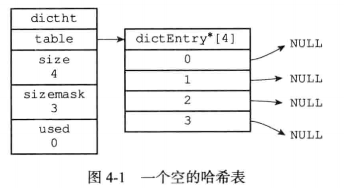
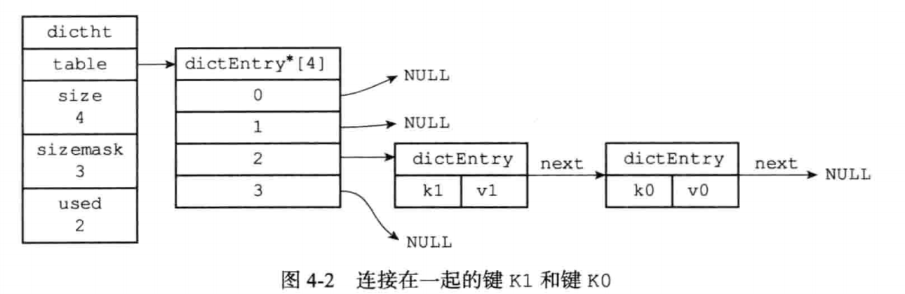
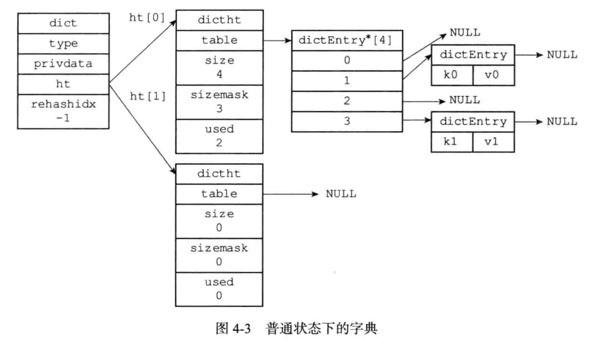
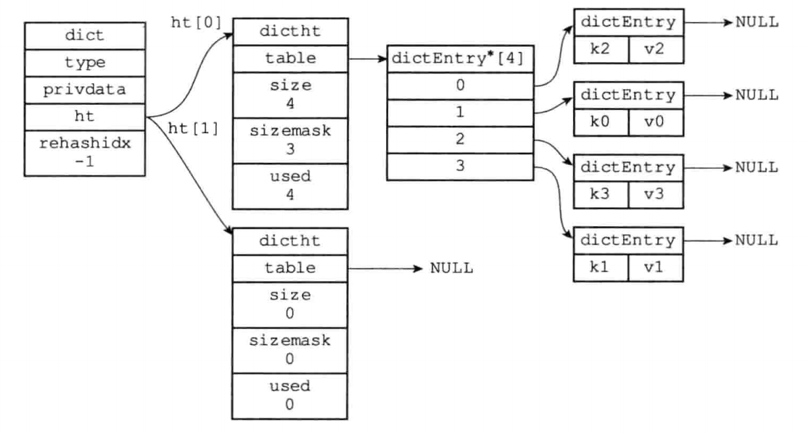
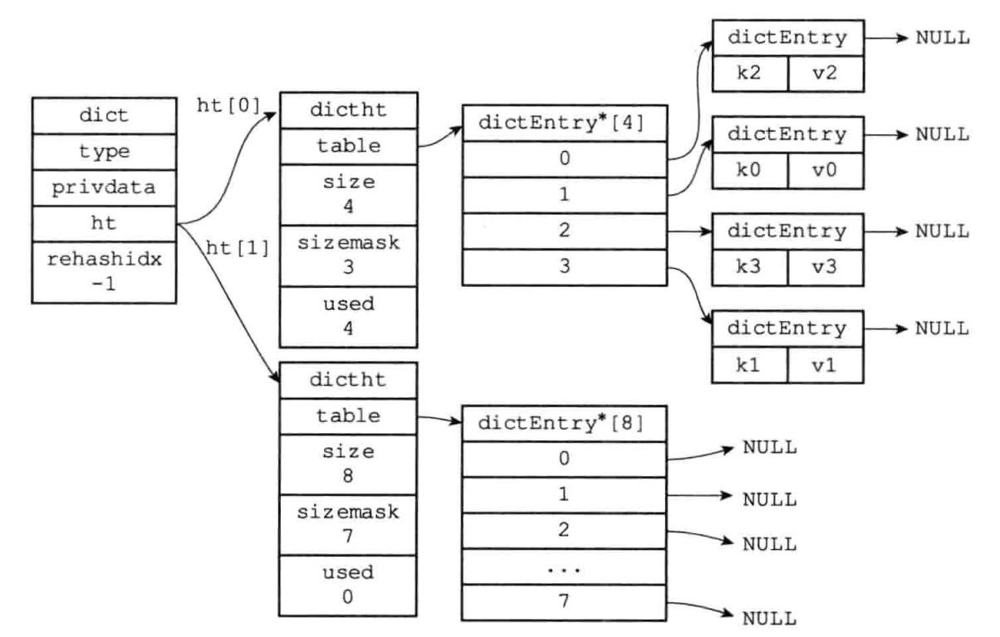
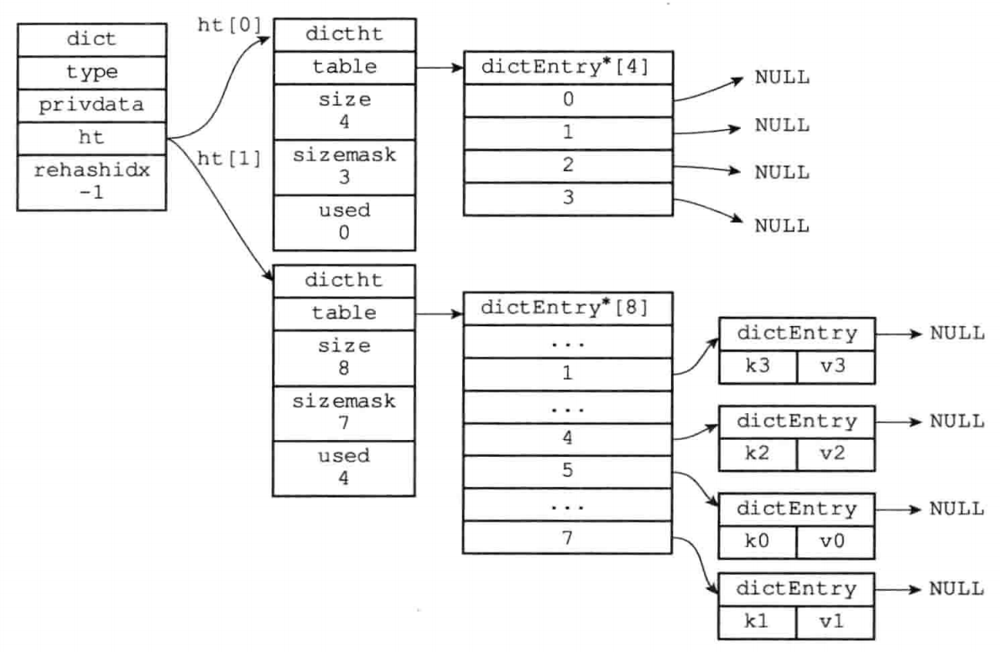
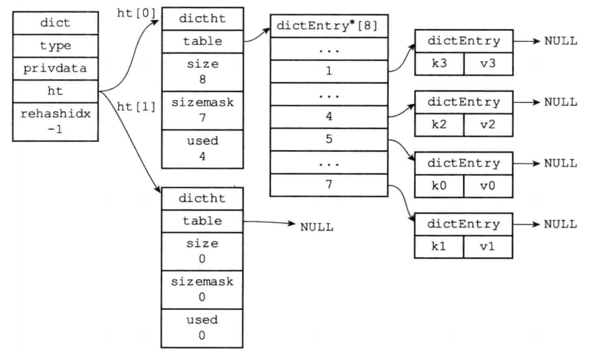

## 字典

#### 1、字典的实现

##### 1.1、哈希表

```c
typedef struct dictht {
    // hash表数组
    dictEntry **table;
    // 哈希表大小
    unsigned long size;
    // 哈希表大小掩码，用于计算索引值
    // 总是等于 size-1
    unsigned long sizemask;
    // 该哈希表已有节点的数量
    unsigned long used;
} dictht;
```

​		table属性是一个数组，数组中的每个元素都是指向dict.h/dictEntry结构的指针，每个dictEntry结构保存着一个键值对。size属性记录了哈希表的大小，也即是table数组的带下，而used属性则记录了哈希表目前已有节点（键值对）的数量。sizemask属性的值总数等于size-1，这个属性和哈希值一起决定一个键应该被放到table数组的哪个索引上面。



##### 1.2、哈希表节点

哈希表节点使用dictEntry结构表示，每个dictEntry结构都保存着一个键值对：

```c
typedef struct dictEntry {
    // 键
    void *key;
    // 值
    union {
        void *val;
        uint64_t u64;
        int64_t s64;
        double d;
    } v;
    // 指向下一个哈希表节点，形成链表
    struct dictEntry *next;
} dictEntry;
```

​		key属性保存着键值对中的键，而v属性则保存着键值对中的值，其中键值对的值可以是一个指针，或者数一个uint64_t的整数，又或者是一个Int64_t整数。

​		next属性是指向拎一个哈希表节点的指针，这个指针可以将多个哈希值相同的键值对链接在一起，以此来解决键冲突（collision）的问题。



##### 1.3、字典

```c
typedef struct dict {
    // 类型特定函数
    dictType *type;
    // 私有数据
    void *privdata;
    // 哈希表
    dictht ht[2];

    long rehashidx; /* rehashing not in progress if rehashidx == -1 */
    int iterators; /* number of iterators currently running */
} dict;
```



#### 2、rehash

​		当哈希表保存的键值对数量太多或者太少时，程序需要对哈希表的大小进行相应的扩展或者收缩。

Redis对字典的哈希表执行rehash的步骤如下：

​	1）为字典的ht[1]哈希表分配空间，这个哈希表的空间大小取决于要执行的操作，以及ht[0]当前包含的键值对数量（即ht[0].used属性的值）：

​		① 如果执行的是扩展操作，那么ht[1]的大小为第一个大于等于ht[0].used * 2 的 $2^n$；

​		② 如果执行的是收缩操作，那么ht[1]的大小为第一个大于等于ht[0].used的 $2^n$；

​	2）将保存在ht[0]中的所有键值对rehash到ht[1]上面：rehash指的是重新计算键的哈希值和索引值，然后将键值对放置到ht[1]哈希表的指定位置上。

​	3）当ht[0]包含的所有键值对都迁移到了ht[1]之后（ht[0]变为空表），释放ht[0]，将ht[1]设置为ht[0]，并在ht[1]新创建一个空白哈希表，为下一次rehash做准备。


##### 如下举例：

​	1）对ht[0]进行扩展操作。



​	2）ht[0].used当前的值为4，4 * 2 = 8，而8恰好是第一个大于等于4的2的n次方，所以程序会将ht[1]哈希表的大小设置为8。



​	3）将ht[0]包含的四个键值对都rehash到ht[1]。



​	4）释放ht[0]，并将ht[1]设置为ht[0]，然后为ht[1]分配一个空白哈希表。至此，对哈希表的扩展操作执行完毕，程序成功将哈希表的大小从原来的4改为了现在的8。



##### 哈希表的扩展和收缩

​	当以下条件中的任意一个被满足时，程序会自动开始对哈希表执行扩展操作：	

​		1）服务器目前没有在执行BGSAVE命令或者BGREWRITEAOF命令，并且哈希表的负载因子大于等于1.

​		2）服务器目前正在执行BGSAVE命令或者BGREWRITEAOF命令，并且哈希表的负载因子大于等于5.

​	当哈希表的负载因子小于0.1时，程序自动开始对哈希表执行收缩操作。


#### 3、渐进式rehash

哈希表渐进式rehash的详细步骤：

​	1）为ht[1]分配空间，让字典同时持有ht[0]和ht[1]两个哈希表。

​	2）在字典中维持一个索引计数器变量rehashidx，并将它的值设置为0，标识rehash工作正式开始。

​	3）在rehash进行期间，每次对字典执行添加、删除、查找或者更新操作时，程序除了执行指定的操作以外，还会顺带将ht[0]哈希表在rehashidx索引上的所有键值对rehash到ht[1]，当rehash工作完成之后，程序将rehashidx属性的值增一。

​	4）随着字典操作的不断执行，最终在某个时间点上，ht[0]的所有键值对都会被rehash至ht[1]，这时程序将rehashidx属性的值设置为-1，标识rehash操作已完成。


##### 渐进式rehash执行期间的哈希表操作

​		因为在进行渐进式rehash的过程中，字典会同时使用ht[0]和ht[1]两个哈希表，所以在渐进式rehash进行期间，字典的删除（delete）、查找（find）、更新（update）等操作会在两个哈希表上进行。例如，要在字典里面查找一个键的话，程序会现在ht[0]里面进行查抄，如果没找到的话，就会继续到ht[1]里面进行查找。