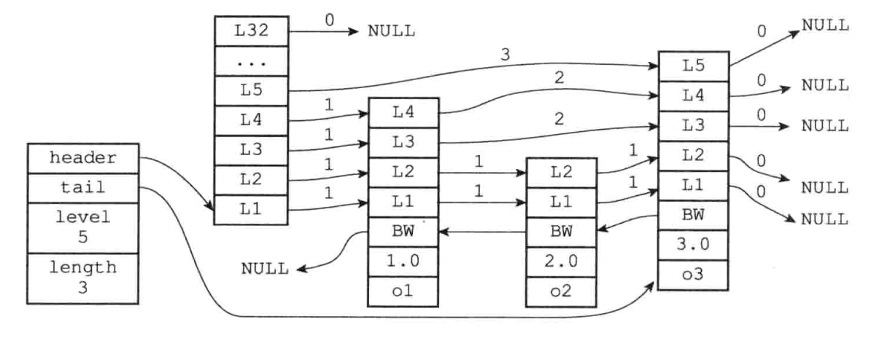

## 跳跃表

#### 1、跳跃表实现

```c
/* ZSETs use a specialized version of Skiplists */
typedef struct zskiplistNode {
    // 成员对象
    robj *obj;
    // 分值，各个节点中所保存的分值
    double score;
    // 后退指针, 指向位于当前节点的前一个节点, 从表头向表尾遍历时使用
    struct zskiplistNode *backward;
    // 层
    struct zskiplistLevel {
        // 前进指针,用于访问位于表尾方向的其他节点
        struct zskiplistNode *forward;
        // 跨度,记录了前进指针所指向节点和当前节点的距离
        unsigned int span;
    } level[];
} zskiplistNode;

typedef struct zskiplist {
    // header: 指向跳跃表的表头节点
    // tail: 指向跳跃表的表尾节点
    struct zskiplistNode *header, *tail;
    // 记录跳跃表的长度，即跳跃表目前包含节点的数量（表头节点不计算在内）
    unsigned long length;
    // 记录目前跳跃表内，曾是最大的哪个节点的层数（表头节点的层数不计算在内）
    int level;
} zskiplist;
```



