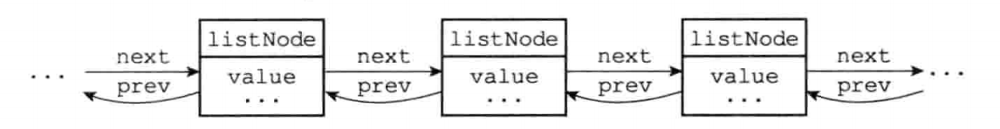
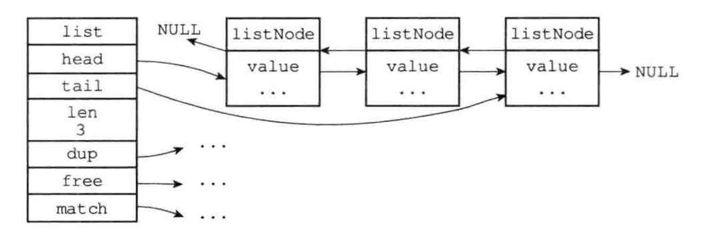

## 链表

#### 1、链表和链表节点的实现

​		每个链表节点使用一个adlist.h/listNode结构来表示：

```c
// 链表数据结构
typedef struct listNode {
    // 前置节点
    struct listNode *prev;
    // 后置节点
    struct listNode *next;
    // 节点的值
    void *value;
} listNode;
```



```c
typedef struct list {
    // 表头节点
    listNode *head;
    // 表尾节点
    listNode *tail;
    // 节点值复制函数
    void *(*dup)(void *ptr);
    // 节点值释放函数
    void (*free)(void *ptr);
    // 节点值对比函数
    int (*match)(void *ptr, void *key);
    // 链表锁包含的几点数量
    unsigned long len;
} list;
```



##### 1.1、Redis的链表实现的特性可以总结如下：

- 双端：链表节点带有prev和next指针，获取某个节点的前置节点和后置节点的复杂度都是O(1)。
- 无环：表头节点的prev指针和表尾节点的next指针都指向NULL，对链表的访问以NULL为终点。
- 带表头指针和表尾指针：通过list结构的head指针和tail指针，程序获取链表的表头节点和表尾节点的复杂度为O(1)。
- 带链表长度计数器：程序使用list结构的len属性来对list持有的链表节点进行计数，程序获取链表中节点数量的复杂度为O(1)。
- 多态：链表节点使用void* 指针来保存节点值，并且可以通过list结构的dup、free、match三个属性为节点值设置类型特定函数，所以链表可以用于保存各种不同类型的值。