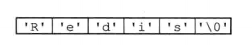
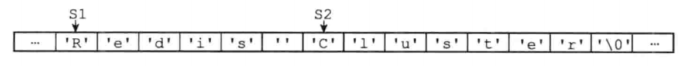

## 简单动态字符串

#### 1、sds定义

```c
// sds字符串结构体
struct sdshdr {
    // 记录buf数组中已使用的字节数量
    // 等于sds所保存的字符串的长度
    unsigned int len;
    // 记录buf数组中未使用的字节数量
    unsigned int free;
    // 字节数组，用来保存字符串
    char buf[];
};
```

#### 2、sds与C字符串的区别

​		C语言使用长度为N+1的字符数组来表示长度为N的字符串，并且字符数组的最后一个元素总是空字符'\0'。




##### 2.1、常熟复杂度获取字符串长度

​		因为C字符串并不记录自身的长度信息，所以为了获取一个C字符串的长度，程序必须遍历整个字符串，对遇到的每个字符进行计数，直到遇到代表字符串结尾的空字符为止，这个操作的复杂度为O(N)。

​		和C字符串不同，因为sds在len属性中记录了sds本身的长度，所以获取一个sds长度的复杂度仅为O(1)。

​		设置和更新sds长度的工作是由sds的API在执行时自动完成的，使用sds无须进行任何手动修改长度的工作。


##### 2.2、杜绝缓冲区溢出

​		举个例子，<string.h>/strcat函数可以将src字符串中的内容拼接到dest字符串的末尾：

​		$char *strcat(char *dest, const char *src);$

​		因为C字符串不记录自身的长度，所以strcat假定用户在执行这个函数时，已经为dest分配了足够多的内存，可以容纳src字符串中的所有内容，而一旦这个假设不成立时，就会产生缓冲区溢出。

​		

​		举个栗子，假设程序里有两个在内存中紧邻着的C字符串s1和s2，其中s1保存了字符串“Redis”，而s2保存了字符串“MongoDB”，


​		如果执行strcat(s1, " Cluster")；将s1的内容修改为“Redis Cluster”，但忘了在执行strcat之前为s1分配足够的空间，那么在strcat函数执行之后，s1的数据将溢出到s1所在的空间中，导致s2保存的内容被意外的修改：



​		与C字符串不同，SDS的空间分配策略完全杜绝了发生缓冲区溢出的可能性：当SDS API需要对sds进行修改时，api会先检查sds的空间十分满足修改所需的要求，如果不满足的话，api会自动将sds的空间扩展至执行修改所需的大小，然后才执行实际的修改操作。


##### 2.3、减少修改字符串时带来的内存重分配次数

​		C字符串的底层实现总是一个N+1个字符长的数组，所以每次增加或者缩短一个C字符串，程序总要对这个C字符串的数组进行一次内存重分配操作。

​		① 如果程序执行的是增长字符串操作，比如拼接操作（append），那么在执行这个操作之前，程序需要先通过内存重分配来扩展底层数组的空间大小——如果忘了这一步就会产生缓冲区溢出。

​		② 如果程序执行的是缩短字符串操作，比如截断操作（trim），那么在执行这个操作之后，程序需要通过内存重分配来释放字符串不再使用的那部分空间——如果忘了这一步就会产生内存泄漏。

​		

​		为了避免C字符串的这种缺陷，sds通过未使用空间解除了字符串长度和底层数组长度之间的关联：在sds中，buf数组的长度不一定就是字符数量加一，数组里面可以包含未使用的字节，而这些字节的数量就由sds的free属性记录。

通过未使用空间，sds实现了空间预分配和惰性空间释放两种优化策略。

###### 2.3.1、空间预分配

​		空间预分配用于优化sds的字符串增长操作：当sds的api对一个sds进行修改，并且需要对sds进行空间扩展的时候，程序不仅为sds分配修改所必须要的空间，还会为sds分配额外的未使用空间。

​		其中，额外分配的未使用空间数量由以下公式决定：

​		①：如果对sds进行修改之后，sds的长度（len）将小于1MB，那么程序分配和len属性同样大小的未使用空间，这时sdslen属性的值讲和free属性的值相同。

​		②：如果对sds进行修改之后，sds的长度大于等于1MB，那么程序会分配1MB的未使用空间。

###### 2.3.2、惰性空间释放

​		惰性空间释放用于优化sds的字符串缩短操作：当sds的api需要缩短sds保存的字符串时，程序并不立即使用内存重分配来回收缩短后多出来的字节，而是使用free属性将这些字节的数量记录起来，并等待将来使用。


##### 2.4、二进制安全

​		C字符串中字符必须符合某种编码（比如ASCII），并且除了字符串的末尾之外，字符串里面不能包含空字符，否则最先被程序读入的空字符将被误认为是字符串的结尾，这些限制使得C字符串只能保存文本数据，而不能保存像图片、音频、视频、压缩文件这样的二进制数据。


##### 2.5、兼容部分C字符串函数


##### 2.6、总结：C字符串和sds之间的区别

|                  C字符串                   |                    SDS                     |
| :----------------------------------------: | :----------------------------------------: |
|        获取字符串长度的复杂度为O(N)        |        获取字符串长度的复杂度为O(1)        |
|    API是不安全的，可能会造成缓冲区溢出     |      API是安全的，不会造成缓冲区溢出       |
| 修改字符串长度N次必然需要执行N次内存重分配 | 修改字符串长度N次最多需要执行N次内存重分配 |
|              只能保存文本数据              |         可以保存文本或者二进制数据         |
|     可以使用所有$<string.h>$库中的函数     |    可以使用一部分$<string.h>$库中的函数    |

