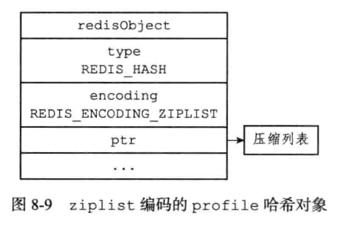
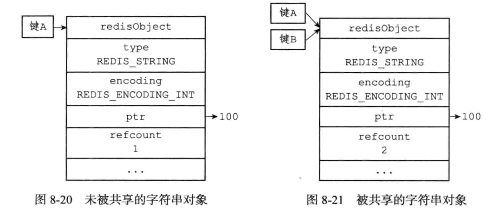

## 对象

​		在前面我们介绍了Redis用到的所有主要数据结构，比如简单动态字符串（SDS）、双端链表、字典、压缩列表、整数集合等等。		

​		Redis并没有直接使用数据结构来实现键值对数据库，而是基于这些数据结构创建了一个对象系统，这个系统包含字符串对象、列表对象、哈希对象、集合对象和有序集合对象这五种类型的对象。Redis的对象系统还实现了基于引用计数的内存回收机制，当程序不再使用某个对象的时候，这个对象所占用的内存就会被自动释放；另外，Redis还通过引用计数技术实现了对象共享机制，这一机制可以再适当的条件下，通过让多个数据库键共享同一个对象来节约内存。

#### 1、对象的类型与编码

​		Redis使用对象来表示数据库中的键和值，每次当我们再Redis的数据库中新创建一个键值对时，我们至少会创建两个对象，一个对象用作键值对的键（键对象），另一个对象用作键值对的值（值对象）。

​		Redis中的每个对象都由一个redisObject结构表示：

```c
typedef struct redisObject {
    // 类型
    unsigned type:4;
    // 编码
    unsigned encoding:4;
  	// 对象最后一次被命令程序访问的时间
    unsigned lru:REDIS_LRU_BITS; /* lru time (relative to server.lruclock) */
    // 引用计数
  	int refcount;
    // 指向底层数据结构实现的指针
    void *ptr;
} robj;
```


##### 1.1、类型

​		对象的type属性记录了对象的类型。这个属性的值可以是下面列出的常量的其中一个。

|   类型常量   |  对象的名称  |
| :----------: | :----------: |
| REDIS_STRING |  字符串对象  |
|  REDIS_LIST  |   列表对象   |
|  REDIS_HASH  |   哈希对象   |
|  REDIS_SET   |   集合对象   |
|  REDIS_ZSET  | 有序集合对象 |

​		对于Redis数据库保存的键值对来说，键总是一个字符串对象，而值则可以是字符串对象、列表对象、哈希对象、集合对象或者有序集合对象的其中一种。

​		$TYPE$命令的实现方式也与此类似，当我们对一个数据库键执行TYPE命令时，返回的结果为数据库对应的值对象的类型，而不是键对象的类型：

```shell
# 键为字符串对象，值为字符串对象
127.0.0.1:6379> set msg "hello world"
OK
127.0.0.1:6379> type msg
string
# 键为字符串对象，值为列表对象
127.0.0.1:6379> rpush numbers 1 3 5
(integer) 3
127.0.0.1:6379> type numbers
list
```


##### 1.2、编码和底层实现

​		对象的ptr指针指向对象的底层实现数据结构，而这些数据结构由对象的encoding属性决定。

​		encoding属性记录了对象所使用的编码，也即是说这个对象使用了什么数据结构作为对象的底层实现。

```c
// 简单动态字符串
#define REDIS_ENCODING_RAW 0     		/* Raw representation */
// embstr编码的简单动态字符串
#define REDIS_ENCODING_EMBSTR
// long类型的整数
#define REDIS_ENCODING_INT 1     		/* Encoded as integer */
// 字典
#define REDIS_ENCODING_HT 2      		/* Encoded as hash table */
#define REDIS_ENCODING_ZIPMAP 3  		/* Encoded as zipmap */
// 双端链表
#define REDIS_ENCODING_LINKEDLIST 4 /* Encoded as regular linked list */
// 压缩列表
#define REDIS_ENCODING_ZIPLIST 5 		/* Encoded as ziplist */
// 整数集合
#define REDIS_ENCODING_INTSET 6  		/* Encoded as intset */
// 跳跃表和字典
#define REDIS_ENCODING_SKIPLIST 7  	/* Encoded as skiplist */
```


#### 2、字符串对象

​		字符串对象的编码可以是int、raw或者embstr

​		如果一个字符串对象保存的是整数值，并且这个整数值可以用long类型来表示，那么字符串对象会将整数值保存在字符串对象结构的ptr属性里面（将void*转换成long），并将字符串对象的编码设置为int。


```shell
127.0.0.1:6379> set number 10086
OK
127.0.0.1:6379> object encoding number
"int"
```

​		如果字符串对象保存的是一个字符串值，并且这个字符串值的长度大于32字节，那么字符串对象将使用一个简单动态字符串（SDS）来保存这个字符串值，并将对象的编码设置为raw。


​		如果字符串对象保存的是一个字符串值，并且这个字符串值的长度小于等于32字节，那么字符串对象将使用embstr编码的方式来保存这个字符串值。


​		embstr编码是专门用于保存段字符串的一种优化编码方式，这种编码和raw编码一样，都使用redisObject结构和sdshdr结构来标识字符串对象，但是raw编码会调用两次内存分配函数来分别创建redisObject结构和sdshdr结构，而embstr编码则通过调用一次内存分配函数来分配一块连续的空间，空间中依次包含redisObject和sdshdr两个结构。

​		可以用long double类型标识的浮点数在Redis中也是作为字符串值来保存的。

```shell
127.0.0.1:6379> set pi 2.14
OK
127.0.0.1:6379> object encoding pi
"embstr"
```


##### 2.1、编码的转换

​		int编码的字符串和embstr编码的字符串对象在条件满足的情况下，会被转换为raw编码的字符串对象。

```shell
127.0.0.1:6379> set number 10086
OK
127.0.0.1:6379> object encoding number
"int"
127.0.0.1:6379> append number " is a good number"
(integer) 22
127.0.0.1:6379> get number
"10086 is a good number"
127.0.0.1:6379> object encoding number
"raw"
```

​		另外，因为Redis没有为embstr编码的字符串对象编写任何相应的修改程序（只有int编码的字符串对象和raw编码的字符串对象有这些程序），所以embstr编码的字符串对象实际上是只读的。当我们对embstr编码的字符串对象执行任何修改命令时，程序会先将对象的编码从embstr转换成raw，然后再执行修改命令。

```shell
127.0.0.1:6379> set msg "hello world"
OK
127.0.0.1:6379> object encoding msg
"embstr"
127.0.0.1:6379> append msg " again"
(integer) 17
127.0.0.1:6379> object encoding msg
"raw"
```


#### 3、列表对象

​		列表对象的编码可以是ziplist或者linkedlist。

​		ziplist编码的列表对象使用压缩列表作为底层实现，每个压缩列表节点（entry）保存了一个列表元素。

```shell
127.0.0.1:6379> rpush numbers 1 "three" 5
(integer) 3
```

如果numbers键的对象使用的是ziplist编码：


如果numbers键创建的列表对象时linkedlist编码：


#### 4、哈希对象




#### 5、集合对象


#### 6、有序集合对象


```c
typedef struct zset {
    dict *dict;
    zskiplist *zsl;
} zset;
```


#### 7、内存回收

​		因为C语言并不具备自动内存回收功能，所以Redis在自己的对象系统中构建了一个引用计数技术实现的内存回收机制，通过这一机制，程序可以通过跟踪对象的引用计数信息，在适当的时候自动释放对象并进行内存回收。

​		每个对象的引用计数信息由redisObject结构的refcount属性记录：

```c
typedef struct redisObject {
    // ...
    // 引用计数
  	int refcount;
    // ...
} robj;
```

对象的引用计数信息会随着对象的使用状态而不断变化：

- 在创建一个新对象时，引用计数的值会被初始化为1；
- 当对象被一个新程序使用时，它的引用计数值会被赠一；
- 当对象不再被一个程序使用时，它的引用计数值会被减一；
- 当对象的引用计数值变为0时，对象所占用的内存会被释放；


##### 修改对象引用计数的API

```c
// 将对象的引用计数值减一，当对象的引用计数值等于0时，释放对象
void decrRefCount(robj *o);
void decrRefCountVoid(void *o);
// 将对象的引用计数值增一
void incrRefCount(robj *o);
// 将对象的引用计数值设置为0，但并不释放对象，这个函数通常在需要重新设置对象的引用计数值时使用
robj *resetRefCount(robj *obj);
```


#### 8、对象共享

​		在Redis中，让多个键共享同一个值对象需要执行以下两个步骤：

​		1）将数据库键的值指针指向一个现有的值对象

​		2）将被共享的值对象的引用计数增一



目前来说，Redis会在初始化服务器时，创建一万个字符串对象，这些对象包含了从0到9999的所有整数值，当服务器需要用到值为0到9999的字符串对象时，服务器就会使用这些共享对象，而不是新创建对象。

<font color="tomato">创建共享字符串对象的数量可以通过修改<font color="BlueViolet">redis.h/REDIS_SHARED_INTEGERS​</font>常量来修改</font>


#### 9、对象的空转时长

​		redisObject结构包含的lru属性记录了对象最后一次被命令程序访问的时间

object idletime命令可以打印给定键的空转时长，这一空转时长就是通过当前时间减去键的值对象的lru时间计算得出的：

```shell
127.0.0.1:6379> set msg "hello world"
OK
127.0.0.1:6379> object idletime msg
(integer) 4
127.0.0.1:6379> object idletime msg
(integer) 10
```

<font color="tomato">object idletime 命令在防卫键的值对象时，不会修改值对象的lru属性</font>

​		键的空转时长还有另外一项作用：如果服务器打开了maxmemory选项，并且服务器用于回收内存的算法为volatile-lru或者allkeys-lru，那么当服务器占用的内存数超过了maxmemory选项所设置的上限值时，空转时长较高的那部分键会优先被服务器释放，从而回收内存。