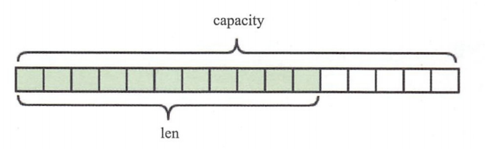

## Redis 远程字典服务(Remote Dicitory Service)

### 1、要体验Redis，我们先从Redis的安装说起

##### 1.1、Redis的安装主要有三种方式

> 1、使用Docker安装
>
> 2、通过github源码编译
>
> 3、直接安装apt-get install（Ubuntu）、yum install（Redhat）、或者brew install（Mac）

###### 1.1.1、Docker方式

```shell
# 拉取docker镜像
> docker pull redis
# 运行docker容器
> docker run --name myredis -d -p6379:6379 redis
# 执行docker容器中的redis-cli，可以直接使用命令行操作Redis
> docker exec -it myredis redis-cli
```

###### 1.1.2、Github源码编译方式

```shell
# 下载源码
> git clone --branch 2.8 --depth 1 git@github.com:antirez/redis.git
> cd redis
# 编译
> make
> cd src
# 运行服务器，daemonize标识在后台运行
> ./redis-server --daemonize yes
# 运行命令行
> ./redis-cli
```

###### 1.1.3、直接安装方式

```shell
# mac
> brew install redis
# ubuntu
> apt-get install redis
# redhat
> yum install redis
# 运行客户端
> redis-cli
```


### 2、5种数据结构

​		Redis有5中基础数据结构，分别为：string（字符串）、list（列表）、hash（字典）、set（集合）和zset（有序集合）。这5中基本数据结构是Redis的相关知识中最基础、最重要的部分。

##### 2.1、string（字符串）

​		字符串string是Redis最简单的数据结构，它的内部标识就是一个字符数组。Redis所有的数据结构都以唯一的key字符串作为名称，然后通过这个唯一key值来获取相应的value数据。不同类型的数据结构的差异就在于value的结构不一样。

​		Redis的字符串是动态字符串，是可以修改的字符串，内部结构的实现类似于Java的ArrayList，采用预分配冗余空间的方式来减少内存的频繁分配，如图所示，内部为当前字符串分配的实际空间capacity一般要高于实际字符串长度len。当字符串长度小于1MB时，扩容都是加倍现有的空间。如果字符串长度超过1MB，扩容时一次只会多扩1MB的空间。<font color= "blue">需要注意的是字符串最大长度为512MB。</font>



<font color = "tomato">【键值对】</font>

​		相当于字典的key和value，支持简单的增删改查操作。下面代码中的”name“就是字典的key，而value就是字符串”codehole“。

```shell
> set name codehole
OK
> get name
"codehole"
> exists name
(integer) 1
> del name
(integer) 1
> get name
(nil)
```

<font color = "tomato">【批量键值对】</font>

​		可以对多个字符串进行批量读写，节省网络耗时开销。

```shell
> set name1 codehole
OK
> set name2 holycoder
OK
> mget name1 name2 name3  # 返回一个列表
1) "codehole"
2) "holycoder"
3) (nil)
> mset name1 boy name2 girl name3 unknown
> mget name1 name2 name2
1) "boy"
2) "girl"
3) "unknown"
```

<font color = "tomato">【过期和set命令扩展】</font>

​		可以对key设置过期时间，到时间会被自动删除，这个功能常用来控制缓存的失效时间。

```shell
> set name codehole
> get name
"codehole"
> expire name 5   # 5s 后过期
...   # 等候5s
> get name
(nil)

> setex name 5 codehole   # 5s后过期，等价于set + expire
> get name
"codehole"
...   # 等候5s
> get name
(nil)

> setnx name codehole   # 如果name不存在就执行set创建
(integer) 1
> get name
"codehole"
> setnx name holycoder
(integer) 0   # 因为name已经存在，所以set创建不成功
> get name
"codehole"   # 没有改变
```

<font color = "tomato">【计数】</font>

​		如果value值是一个整数，还可以对它进行自增操作。自增是有范围的，它的范围在signed long的最大值和最小值之间，超过了这个范围，Redis会报错。

```shell
> set age 30
OK
> incr age
(integer) 31
> incrby age 5
(integer) 36
> incrby age -5
(integer) 31
> set codehole 9223372036854775807
> incr codehole
(error) ERR increment or decrement would overflow 
```

​		字符串由多个字节组成，每个字节又由8个bit组成，如此便可以将一个字符串看成很多bit的组合，这边是bitmap（位图）数据结构。

##### 2.2、list（列表）

​		Redis的列表相当于Java语言里面的LinkedList，注意它是链表而不是数组。这意味着list的插入和删除操作非常快，时间复杂度为O(1)，但是索引定位很慢，时间复杂度为O(n)，如图所示，列表中的每个元素都使用双向指针顺序，串起来可以同时支持前向后向遍历。

​		当列表弹出了最后一个元素之后，该数据结构被自动删除，内存被回收。


​		Redis的列表结构常用来做异步队列使用。将需要延后处理的任务结构体序列化成字符串，塞进Redis的列表，另一个线程从这个列表中轮询数据进行处理。

<font color = "tomato">【右边进左边出：队列】</font>

​		队列是先进先出的数据结构，常用于消息排队和异步逻辑处理，它会确保元素的访问顺序性。

```shell
> rpush books python java golang
(integer) 3
> llen books
(integer) 3
> lpop books
"python"
> lpop books
"java"
> lpop books
"golang"
> lpop books
(nil)
```

<font color = "tomato">【右边进右边出：栈】</font>

​		栈是先进后出的数据结构

```shell
> rpush books python java golang
(integer) 3
> rpop books
"golang"
> rpop books
"java"
> rpop books
"python"
> rpop books
(nil)
```

<font color = "tomato">【慢操作】</font>

​		lindex相当于Java链表的get(int index)方法，它需要对链表进行遍历，性能随着参数index增大而变差。

​		ltrim的两个参数start_index和end_index定义了一个区间，在这个区间内的值，ltrim要保留，区间之外的则统统砍掉。我们可以通过ltrim来实现一个定长的链表。

​		index可以为负数，index=-1表示倒数第一个元素，同理index=-2表示倒数第二个元素。

```shell
> rpush books python java golang
(integer) 3
> lindex books 1   # O(n)慎用
"java"
> lrange books 0 -1   # 获取所有元素,O(n)慎用
1) "python"
2) "java"
3) "golang"
> ltrim books 1 -1   # O(n)慎用
OK
> lrange books 0 -1
1) "java"
2) "golang"
> ltrim books 1 0   # 这其实是清空了整个列表，因为区间范围长度为负
OK
> llen books
(integer) 0
```

<font color = "tomato">【快速列表】</font>

​		如果再深入一点，会发现Redis底层存储的不是一个简单的linkedlist，而是称之为”快速链表“（quicklist）的一个结构。

​		首先在列表较少的情况下，会使用一块连续的内存存储，这个结构是ziplist，即压缩列表。它将所有的元素彼此紧挨着一起存储，分配的是一块连续的内存。当数据量比较多的时候才会改为quicklist。因为普通的链表需要的附加指针空间太大，会浪费空间，还会加重内存的碎片化，比如某普通链表里存的只是int类型的数据，结构上还需要两个额外的指针prev和next。所以Redis将链表和ziplist结合起来组成了quicklist，也就是将多个ziplist使用双向指针串起来使用。quicklist既满足了快速的插入删除性能，又不会出现太大的空间冗余。


##### 2.3、hash（字典）

​		Redis的字典相当于Java语言里面的HashMap，


​		它是无序字典，内部存储了很多键值对。实现结构上与Java的hashMap也是一样的，都是”数组 + 链表“二维结构。第一维hash的数组位置碰撞时，就会将碰撞的元素使用链表串接起来。


​		不同的是，Redis的字典的值只能是字符串，另外他们rehash的方式不一样，因为Java的HashMap在字典很大时，rehash是个耗时的操作，需要一次性全部rehash。Redis为了追求高性能，不能堵塞服务，所以采用了渐进式rehash策略。

​		渐进式rehash会在rehash的同事，保留新旧两个hash结构，查询时会同事查询两个hash结构，然后在后续的定时任务以及hash操作指令中，循序渐进地将旧hash的内容一点点地迁移到新的hash结构中。当搬迁完成了，就会使用新的hash结构取而代之。


​		当hash移除了最后一个元素之后，该数据结构被自动删除，内存被回收。

​		hash结构也可以用来存储用户信息，与字符串需要一次性全部序列化整个对象不同，hash可以对用户结构中的每个字段单独存储。这样当我们需要获取用户信息时可以进行部分获取。而以整个字符串的形式去保存用户信息的话，就只能一次性全部读取，这样就会浪费网络流量。

​		hash也有缺点，hash结构的存储消耗要高于单个字符串。到底该使用hash还是字符串，需要根据实际情况再三权衡。

```shell
> hset books java "think in java"   # 命令行的字符串如果包含空格，要用引号括起来
(integer) 1
> hset books golang "concurrency in go"
(integer) 1
> hset books python "python cookbook"
(integer) 1
> hgetall books  # entries(), key和value间隔出现
1) "java"
2) "think in java"
3) "golang"
4) "concurrency in go"
5) "python"
6) "python cookbook"
> hlen books
(integer) 3
> hget books java
"think in java"
> hset books golang "learning go programming"   # 更新操作，所以返回0
(integer) 0
> hget books golang
"learning go programming"
> hmset books java "effective java" python "learning python" golang "modern golang programming"   # 批量set
OK
```

​		同字符串一样，hash结构中单个子key也可以进行计数，它对应的指令是hincrby，和incr的使用方法基本一样。

```shell
> hset user-laoqian age 29
(integer) 1
> hincrby user-laoqian age 1
(integer) 30
```

##### 2.4、set（集合）

​		Redis的集合相当于Java语言里面的HashSet，它内部的键值对是无序的、唯一的。它的内部实现相当于一个特殊的字典，字典中所有的value都是一个值NULL。

​		当集合中最后一个元素被移除后，数据结构被自动删除，内存被回收。

```shell
> sadd books python
(integer) 1
> sadd books python # 重复
(integer) 0
> sadd books java golang
(integer) 2
> smembers books   # 注意顺序，和插入的并不一致，因为set是无序的
1) "golang"
2) "python"
3) "java"
> sismember books java   # 查询某个value是否存在，相当于contains(o)
(integer) 1
> sismember books rust
(integer) 0
> scard books   # 获取长度相当于count()
(integer) 3
> spop books   # 弹出一个
"golang"
```

##### 2.5、zset（有序列表）

​		zset可能是Redis提供的最有特色的数据结构，它类似于Java的SortedSet和HashMap的结合体，一方面它是一个set，保证了内部value的唯一性，另一方面它可以给每个value赋予一个score，代表这个value的排序权重。它的内部实现是用了一种叫做”跳跃列表“的数据结构。

​		zset中最后一个value被移除后，数据结构被自动删除，内存被回收。


<font color = "tomato">【跳跃列表】</font>

​		zset内部的排序功能是通过”跳跃列表“数据结构来实现的。

​		因为zset要支持随机的插入和删除，所以它不宜使用数据来表示。我们先来看一个普通的链表数据结构。如图


​		跳跃列表类似于层级制，最下面一层所有的元素都会串起来。然后每隔几个元素挑选出一个代表， 再将这几个代表使用另外一级指针串起来。然后在这些代表里再挑出二级代表，再串起来。最终形成金字塔结构。

