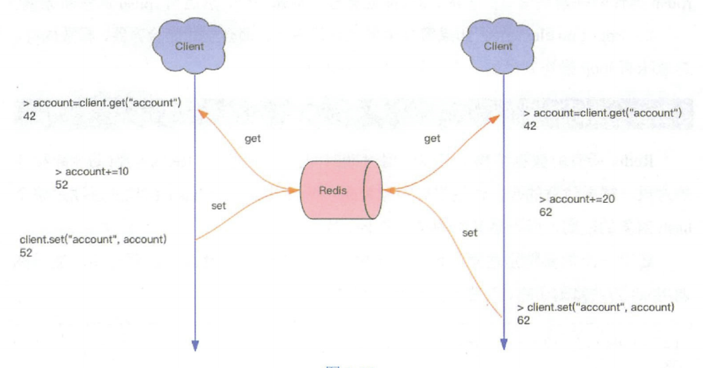

### 千帆竞发-分布式锁

#### 1、分布式应用进行逻辑处理时经常会遇到并发问题。

​		如图，一个操作要修改用户的状态。修改状态需要先读出用户的状态，在内存里进行修改，改完了再存回去。



​		如果这样的操作同时进行，就会出现并发问题，因为”读取“和”保存状态“这两个操作不是原子操作。（<font color = "brown">原子操作</font>是指不会被线程调度机制打断的操作。这种操作一旦开始，就会一直运行到结束，中间不会有任何线程切换。）

##### 1.1、分布式锁的奥义

​		分布式锁本质上要实现的目标就是在Redis里面占一个”坑“，当别的进程也要来占坑时，发现那里已经有一根”大萝卜“了，就只好放弃或者稍后再试。

​		占坑一般使用setnx(set if not exists)指令，只允许被一个客户端占坑。先来先占，用完了，再调用del指令释放”坑“。

```shell
> setnx lock:codehole true
OK
... do something critical ...
> del lock:codehole
(integer) 1
```

​		但是有个问题，如果逻辑执行到中间出现异常了，可能会导致del指令没有被调用，这样就会陷入死锁，锁永远得不到释放。

​		于是我们在拿到锁之后，再给锁加上一个过期时间，比如5s，这样即使中间出现异常也可以保证5s之后锁会自动释放。

```shell
> setnx lock:codehole true
OK
> expire lock:codehole 5
... do something critical ...
> del lock:codehole
(integer) 1
```

​		如果在setnx和expire之间服务器进程突然挂掉了，就会导致expire得不到执行，也会造成死锁。


​		这种问题的根源就在于setnx和expire是两条指令而不是原子指令。在Redis2.8版本中，作者加入了set指令的扩展参数，使得setnx和expire指令可以一起执行，彻底解决了分布式锁的乱象。

```shell
> set lock:codehole true ex 5 nx
OK
... do something critical ...
> del lock:codehole
```

##### 1.2、超时问题

​		Redis的分布式锁不能解决超时问题，如果是在加锁和释放锁之间的逻辑执行得太长，以至于超出了锁的超时限制，就会出现问题。因为这时候第一个线程持有的锁过期了，临界区的逻辑还没有执行完，而同时第二个线程就提前重新持有了这把锁，导致临界区代码不能得到严格串行执行。