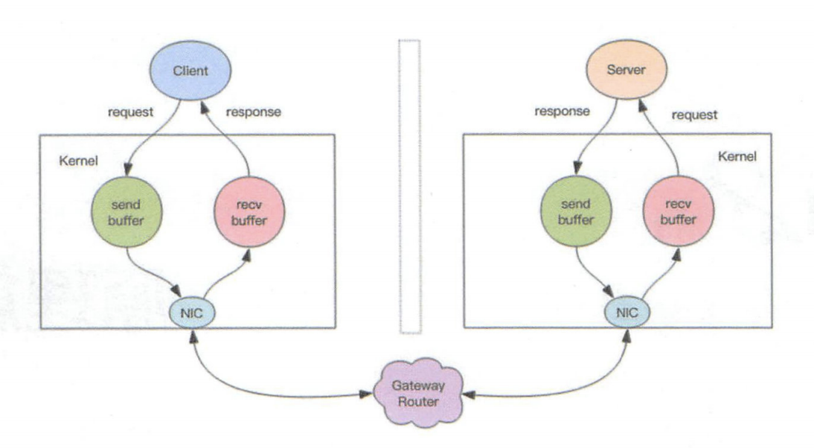
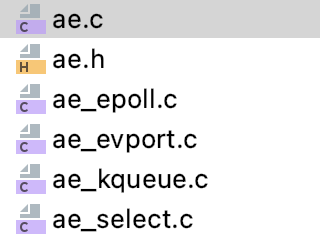

## Redis是个单线程程序

Redis服务器时一个事件驱动程序，服务器需要处理以下两类事件：

- 文件事件：Redis服务器通过套接字与客户端（或者其他Redis服务器）进行连接，而文件事件就是服务器对套接字操作的抽象。服务器与客户端的通信会产生相应的文件事件，而服务器则通过监听并处理这些事件来完成一系列网络通信操作。
- 时间事件：Redis服务器中的一些操作（比如serverCron函数）需要再给定的时间点执行，而时间事件就是服务器对这类定时操作的抽象。


#### 1、文件事件

##### 1.1、文件事件处理器的构成

文件事件处理器的四个组成部分：套接字、I/O多路复用程序、文件事件分派器、事件处理器


​		I/O多路复用程序负责监听多个套接字，并向文件事件分派器传送那些产生了事件的套接字。

​		尽管多个文件事件可能会并发地出现，但I/O多路复用程序总是会将所有产生事件的套接字都放到一个队列里面，然后通过这个队列，以有序、同步、每次一个套接字的方式向文件事件分派器传送套接字。当上一个套接字产生的事件被处理完毕之后，I/O多路复用程序才会继续向文件事件分派器传送下一个套接字。


##### 1.2、I/O多路复用程序的实现

###### 1.2.1、非阻塞IO

​		当我们调用套接字的读写方法，默认它们是阻塞的，比如read方法要传递进去一个参数n，表示最多读取n个字节后再返回，如果一个字节都没有，线程就会卡在那里，直到新的数据到来或者连接关闭，read方法才可以返回，线程才能继续处理。write方法一般来说不会阻塞，除非内核为套接字分配的写缓冲区已经满了，write方法就会阻塞，直到缓冲区中有空间空闲出来。



​		非阻塞IO在套接字对象上提供了一个选项Non-Blocking，当这个选项打开时，读写方法不会阻塞，而是能读多少读多少，能写多少写多少。能读多少取决于内核为套接字分配的读缓冲区内部的数据字节数，能写多少取决于内核为套接字分配的写缓冲区的空闲空间字节数。读方法和写方法都会通过返回值来告知程序实际读写了多少字节。

​		有了非阻塞IO意味着线程在读写IO时可以不必再阻塞了，读写可以瞬间完成，然后线程就可以继续干别的事了。

###### 1.2.1、事件轮询（多路复用）

​		Redis的I/O多路复用程序的所有功能都是通过包装常见的select、epoll、evport和kqueue这些I/O多路复用函数库来实现的。



​		Redis在I/O多路复用程序的实现源码中用#include宏定义了相应的规则，程序会在编译时自动选择系统中性能最高的I/O多路复用函数库来作为Redis的I/O多路复用程序的底层实现：

```c
/* Include the best multiplexing layer supported by this system.
 * The following should be ordered by performances, descending. */
#ifdef HAVE_EVPORT
#include "ae_evport.c"
#else
    #ifdef HAVE_EPOLL
    #include "ae_epoll.c"
    #else
        #ifdef HAVE_KQUEUE
        #include "ae_kqueue.c"
        #else
        #include "ae_select.c"
        #endif
    #endif
#endif
```


##### 1.3、文件事件的处理器

###### 1.3.1、连接应答处理器

​		networking.c/acceptTcpHandler函数是Redis的连接应答处理器，这个处理器用于对链接服务器监听套接字的客户端进行应答，具体实现为sys/socket.h/accept函数的包装。

​		当Redis服务器进行初始化的时候，程序会将这个链接应答处理器和服务器监听套接字的AE_READABLE事件关联起来，当有客户端用sys/socket.h/connect函数链接服务器监听套接字的时候，套接字就会产生AE_READABLE事件，引发连接应答处理器执行，并执行相应的套接字应答操作。


###### 1.3.2、命令请求处理器

​		networking.c/readQueryFromClient函数时Redis的命令请求处理器，这个处理器负责从套接字中读入客户端发送的命令请求内容，具体实现为unistd.h/read函数的包装。

​		当一个客户端通过连接应答处理器成功连接到服务器之后，服务器会将客户端套接字的AE_READABLE事件和命令请求处理器关联起来，当客户端向服务器发送命令请求的时候，套接字就会产生AE_READABLE事件，引发命令请求处理器执行，并执行相应的套接字读入操作。

​		在客户端连接服务器的整个过程中，服务器都会一直为客户端套接字的AE_READABLE事件关联命令请求处理器。


###### 1.3.3、命令回复处理器

​		networking.c/sendReplyToClient函数时Redis的命令回复处理器，这个处理器负责将服务器执行命令后得到的命令回复通过套接字返回给客户端，具体实现为unistd.h/write函数的包装。

​		当服务器有命令回复需要传送给客户端的时候，服务器会将客户端套接字的AE_WRITEABLE事件和命令回复处理器关联起来，当客户端准备好接收服务器传回的命令回复时，就会产生AE_WRITEABLE事件，引发命令回复处理器执行，并执行相应的套接字写入操作。

​		当命令回复发送完毕之后，服务器就会解除命令回复处理器与客户端套接字的AE_WRITEABLE事件之间的关联。


###### 1.3.4、一次完整的客户端与服务器连接事件示例


#### 2、时间事件

Redis的时间事件分为以下两类：

- 定时事件：让一段程序在指定的时间之后执行一次。
- 周期性事件：让一段程序每隔指定时间就执行一次。

一个时间事件主要由以下三个属性组成：

- id：服务器为时间事件创建的全局唯一ID（标识号）。ID号按从小到大的顺序递增，新事件的ID号比旧事件的ID号要大。
- when：毫秒精度的UNIX时间戳，记录了时间事件的到达（arrive）时间。
- timeProc：时间事件处理器，一个函数。当时间事件到达时，服务器就会调用相应的处理器来处理事件。


##### 2.1、实现

​		服务器将所有时间事件都放在一个无序链表中，每当时间事件执行器运行时，它就遍历整个链表，查找所有已到达的时间事件，并调用相应的事件处理器。


​		注意，我们说保存时间事件的链表为无序链表，指的不是链表不按ID排序，而是说，该链表不按when属性的大小排序。所以当时间时间执行器运行的时候，它必须遍历链表中的所有时间事件，这样才能确保服务器中所有已到达的时间事件都会被处理。