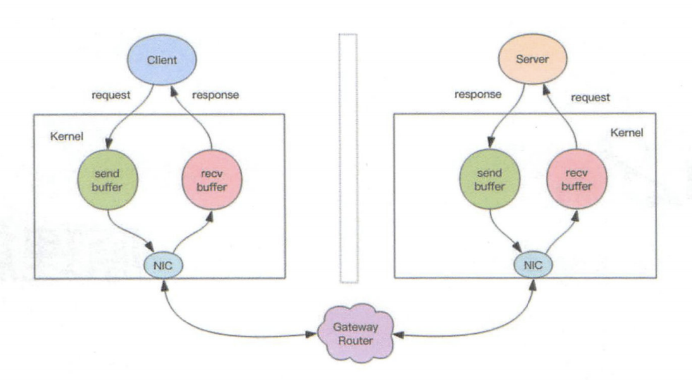

## Redis是个单线程程序

#### 1、非阻塞IO

​		当我们调用套接字的读写方法，默认它们是阻塞的，比如read方法要传递进去一个参数n，表示最多读取n个字节后再返回，如果一个字节都没有，线程就会卡在那里，直到新的数据到来或者连接关闭，read方法才可以返回，线程才能继续处理。write方法一般来说不会阻塞，除非内核为套接字分配的写缓冲区已经满了，write方法就会阻塞，直到缓冲区中有空间空闲出来。

​		非阻塞IO在套接字对象上提供了一个选项Non-Blocking，当这个选项打开时，读写方法不会阻塞，而是能读多少读多少，能写多少写多少。能读多少取决于内核为套接字分配的读缓冲区内部的数据字节数，能写多少取决于内核为套接字分配的写缓冲区的空闲空间字节数。读方法和写方法都会通过返回值来告知程序实际读写了多少字节。

​		有了非阻塞IO意味着线程在读写IO时可以不必再阻塞了，读写可以瞬间完成，然后线程就可以继续干别的事了。

#### 2、事件轮询（多路复用）

