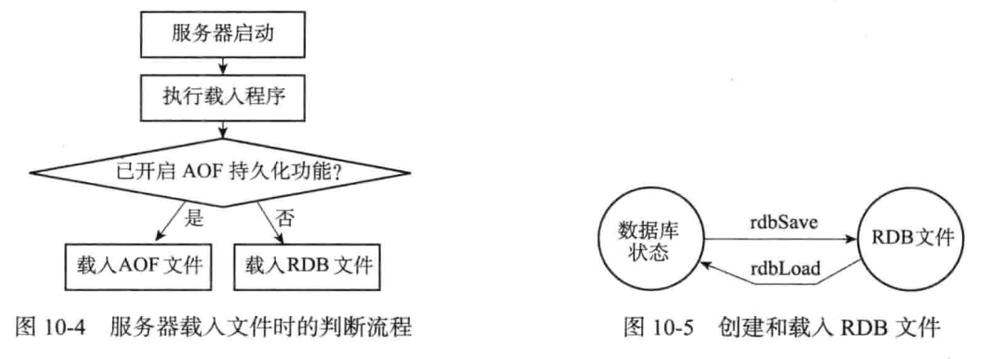

## 持久化

### 1、RDB持久化

​		Redis持久化功能所生成的RDB文件是一个经过压缩的二进制文件，通过该文件可以还原生成RDB文件时的数据库状态。

#### 1.1、RDB文件的创建和载入

​		有两个Redis命令可以用于生成RDB文件，一个是SAVE，另一个是BGSAVE。

​		SAVE命令会阻塞Redis服务器进程，直到RDB文件创建完毕为止，在服务器进程阻塞期间，服务器不能处理任何命令请求

​		BGSAVE命令会派生出一个子进程，然后由子进程负责创建RDB文件，服务器进程（父进程）继续处理命令请求

​		创建RDB文件的实际工作由rdb.c/rdbSave函数完成。

因为AOF文件的更新频率通常比RDB文件的更新频率高，所以：

- 如果服务器开启了AOF持久化功能，那么服务器会优先使用AOF文件来还原数据库状态
- 只有在AOF持久化功能处于关闭状态时，服务器才会使用RDB文件来还原数据库状态

### 2、AOF持久化

