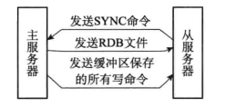
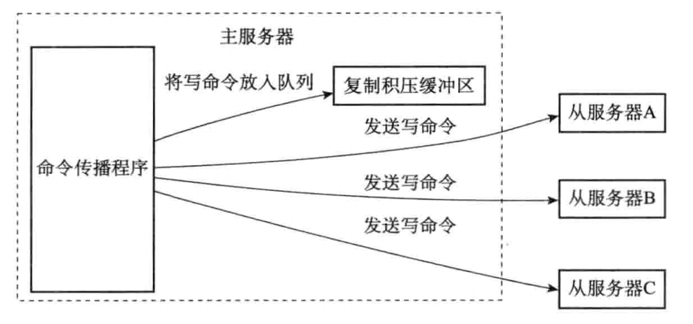
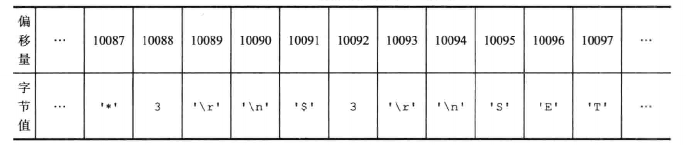

## 多机数据库的实现

### 1、复制

​		在Redis中，用户可以通过执行SLAVEOF命令或者设置slaveof选项，让一个服务器去复制另一个服务器。

#### 1.1、旧版复制功能的实现

Redis的复制功能分为同步（sync）和命令传播（command propagate）两个操作：

- 同步操作用于将从服务器的数据库状态更新至主服务器当前所处的数据库状态。
- 命令传播操作则用于在主服务器的数据库状态被修改，导致主从服务器的数据库状态出现不一致时，让主从服务器的数据库重新回到一致状态。

##### 1.1.1、同步

当客户端向从服务器发送SLAVEOF命令，要求从服务器复制主服务器时，从服务器首先需要执行同步操作：

​	1）从服务器向主服务器发送SYNC命令。

​	2）收到SYNC命令的主服务器执行BGSAVE命令，在后台生成一个RDB文件，并使用一个缓冲区记录从现在开始执行的所有写命令。

​	3）当主服务器的BGSAVE命令执行完毕时，主服务器会将BGSAVE命令生成的RDB文件发送给从服务器，从服务器接收并载入这个RDB文件，将自己的数据库状态更新至主服务器执行BGSAVE命令时的数据库状态。

​	4）主服务器将记录在缓冲区里面的所有写命令发送给从服务器，从服务器执行这些谢明令，将自己的数据库状态更新至主服务器数据库当前所处的状态。

##### 1.1.2、命令传播

在同步操作执行完毕之后，主从服务器两者的数据库将达到一致状态，但每当主服务器执行客户端发送的写命令时，主服务器的数据库就有可能被修改，并导致主从服务器状态不再一致。

为了让主从服务器再次回到一致状态，主服务器需要对从服务器执行命令传播操作：主服务器会将自己执行的写命令，发送给从服务器执行，当从服务器执行了相同的写命令之后，主从服务器将再次回到一致状态。

#### 1.2、新版复制功能的实现

​		为了解决旧版复制功能在处理断线复制情况时低效问题，从Redis2.8版本开始，使用PSYNC命令代替SYNC命令来执行复制时的同步操作。

​		PSYNC命令具有完整重同步和部分重同步两种模式：

- 完整重同步用于初次复制情况。
- 部分重同步则用于处理断线后复制情况：当从服务器在断线后重新连接主服务器时，如果条件允许，主服务器可以将主服务器连接断开期间执行的写命令发送给从服务器，从服务器只要接收并执行这些写命令，就可以将数据库更新至主服务器当前所处的状态。

#### 1.3、部分重同步的实现

部分重同步功能由以下三个部分构成：

- 主服务器的复制偏移量和从服务器的复制偏移量
- 主服务器的复制积压缓冲区
- 服务器的运行ID

##### 1.3.1、复制偏移量

执行复制的双方——主服务器和从服务器会分别维护一个复制偏移量：

- 主服务器每次向从服务器传播N个字节的数据时，就将自己的复制偏移量的值加上N。
- 从服务器每次收到主服务器传播来的N个字节的数据时，就将自己的复制偏移量的值加上N。

通过对比主从服务器的复制偏移量，程序可以很容易的知道主从服务器是否处于一致状态：

- 如果主从服务器处于一致状态，那么主从服务器两者的偏移量总是相同的。
- 相反，如果主从服务器两者的偏移量并不相同，那么说明主从服务器并未处于一致状态。

##### 1.3.2、复制积压缓冲区

​	复制积压缓冲区是由主服务器维护的一个固定长度（fixed-size）先进先出（FIFO）队列，默认大小为1MB。

​	当主服务器进行命令传播时，它不仅会将写命令发送给所有从服务器，还会将写命令入队到复制积压缓冲区里面。

​	主服务器的复制积压缓冲区里面会保存着一部分最近传播的写命令，并且复制积压缓冲区会为队列中的每个字节记录相应的复制偏移量。

​	当从服务器重新连上主服务器时，从服务器会通过PSYNC命令将自己的复制偏移量offset发送给主服务器，主服务器会根据这个复制偏移量来决定对从服务器执行何种同步操作：

- 如果offset偏移量之后的数据仍然存在于复制积压缓冲区里面，那么主服务器将对从服务器执行部分重同步操作。
- 如果offset偏移量之后的数据已经不存在与复制积压缓冲区，那么主服务器将对从服务器执行完整重同步操作。

##### 1.3.3、服务器运行ID

- 每个Redis服务器，不论主服务器还是从服务器，都会有自己的运行ID。
- 运行ID在服务器启动时自动生成，由40个随机的十六进制字符组成。

当从服务器对主服务器进行初次复制时，主服务器会将自己的运行ID传送给从服务器，从服务器会将这个运行ID保存起来。	

当从服务器断线并重新连上一个主服务器时，从服务器将向当前连接的主服务器发送之前保存的运行ID：

- 如果从服务器保存的运行ID和当前连接的主服务器的运行ID相同，那么主服务器可以继续尝试执行部分重同步操作。
- 如果不相同，主服务器将对从服务器执行完整重同步操作。

