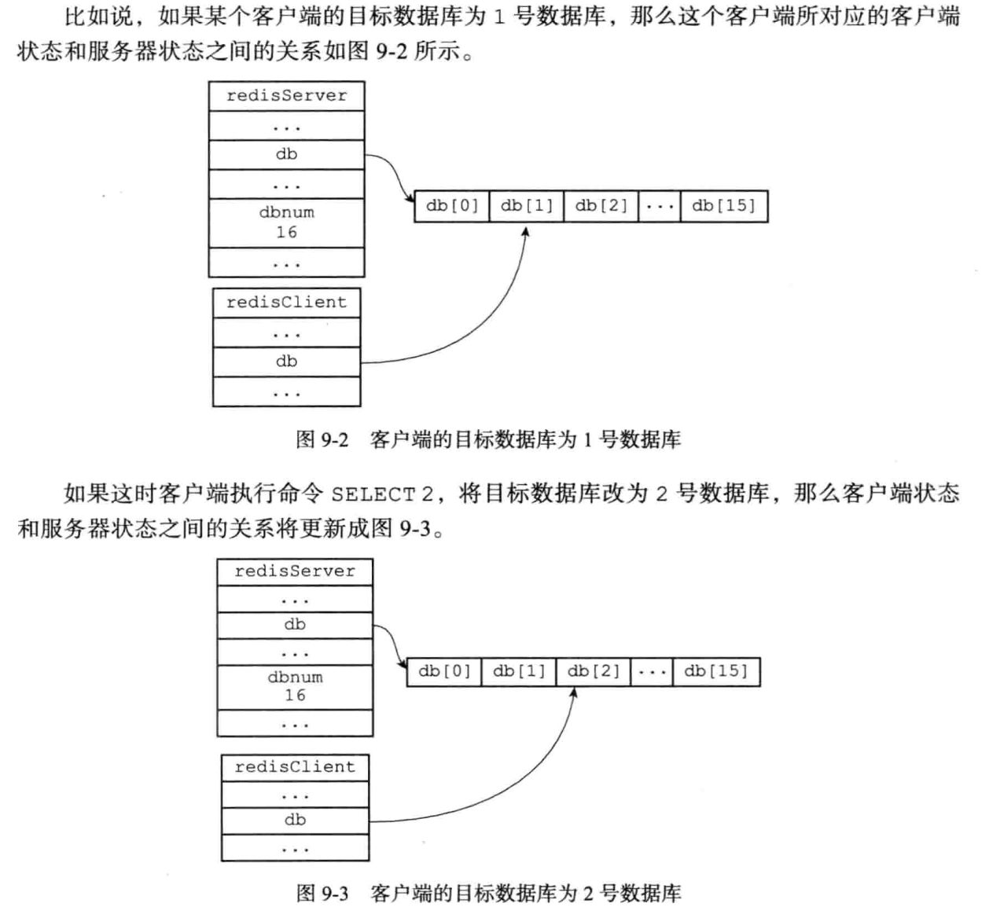
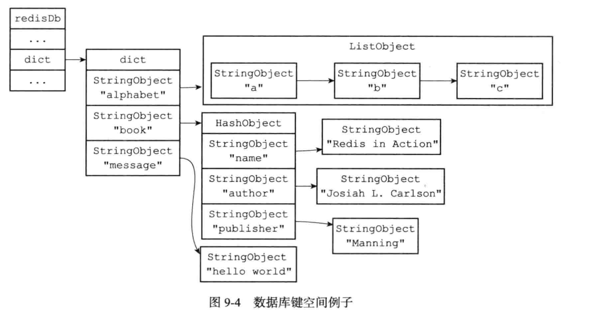
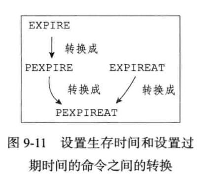
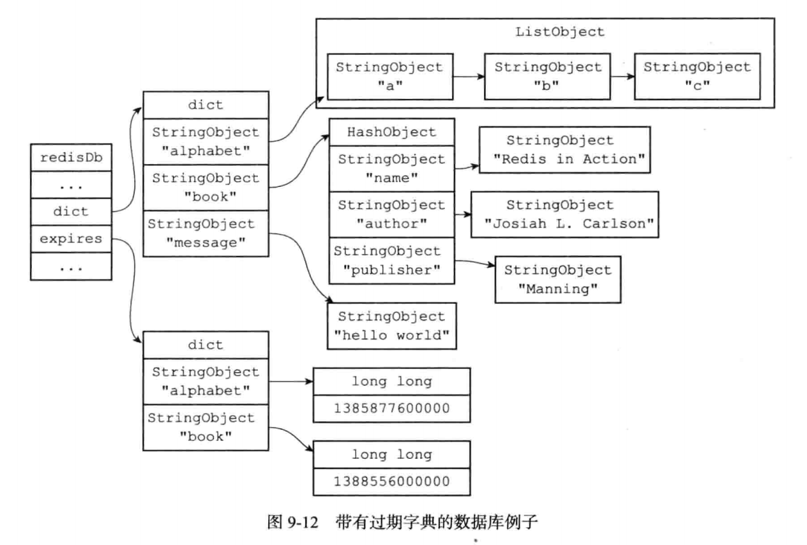
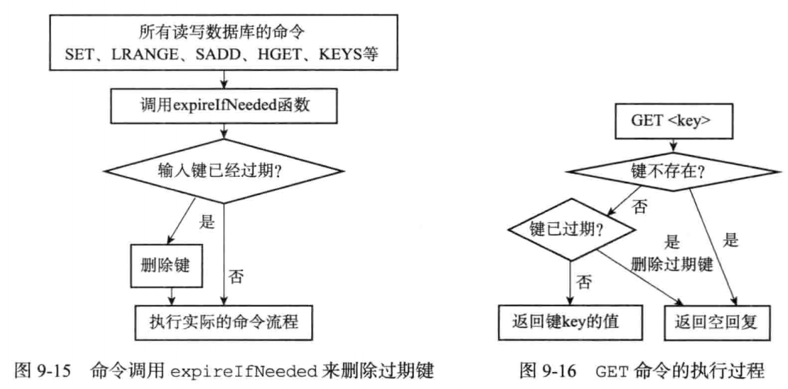

## 单机数据库的实现

#### 1、数据库

##### 1.1、服务器中的数据库

```c
struct redisServer {
  // ...
  // 一个数据，保存着服务器中的所有数据库
  redisDb *db;
  
  // ...
  // 服务器中的数据库数量
  int dbnum;
  
  // ...
}
```


##### 1.2、切换数据库	

通过修改redisClient.db指针，让它指向服务器中的不同数据库，从而实现切换目标数据库的功能——这就是select命令的实现原理：




##### 1.3、数据库键空间

​		Redis是一个键值对（key-value pair）数据库服务器，服务器中的每个数据库都由一个redis.h/redisDb结构表示：

```c
typedef struct redisDb {
   	// 数据库键空间，保存着数据库中的所有键值对
    dict *dict;                 /* The keyspace for this DB */
  	// 过期字典，保存着键的过期时间
    dict *expires;              /* Timeout of keys with a timeout set */
    dict *blocking_keys;        /* Keys with clients waiting for data (BLPOP) */
    dict *ready_keys;           /* Blocked keys that received a PUSH */
    dict *watched_keys;         /* WATCHED keys for MULTI/EXEC CAS */
    int id;
    long long avg_ttl;          /* Average TTL, just for stats */
} redisDb;
```



###### 1.3.1、读写键空间时的维护操作

​		当使用Redis命令对数据库进行读写时，服务器不仅会对键空间执行指定的读写操作，还是执行一些额外的维护操作，其中包括：

- 在读取一个键之后（读操作和写操作都要对键进行读取），服务器会根据键是否存在来更新服务器的键空间命中（hit）次数或键空间不命中（miss）次数，这两个值可以再INFO stats命令的keyspace_hists属性和keyspcae_misses属性中查看。
- 在读取一个键之后，服务器会更新键的LRU（最后一次使用）时间，这个值可以用于计算键的空闲事件。
- 如果服务器在读取一个键时发现该键已经过期，那么服务器会先删除这个过期键，然后才执行余下的其他操作
- 如果客户端使用watch命令监视了某个键，那么服务器在对被监视的键进行修改之后，会将这个键标记为脏（dirty），从而让事务程序注意到这个键已经被修改了。
- 服务器每次修改一个键之后，都会对脏（dirty）键计数器的值增1，这个计数器会触发服务器的持久化以及复制操作。
- 如果服务器开启了数据库通知功能，那么在对键进行修改之后，服务器将按配置发送相应的数据库通知。


##### 1.4、设置键的生存时间或过期时间

​		通过expire命令或者pexpire命令，客户端可以以秒或者毫秒精度为数据库中的某个键设置生存时间，在经过指定的秒数或者毫秒数之后，服务器就会自动删除生存时间为0的键。

###### 1.4.1、设置过期时间

​		Redis有四个不同的命令可以用于设置键的过期时间：

- $EXPIRE <key> <ttl>$ 命令用于将键key的生存时间设置为ttl秒

- $PEXPIRE<key> <ttl>$ 命令用于将键key的生存时间设置为ttl毫秒

- $EXPIREAT <key> <timestamp>$ 命令用于将键key的过期时间设置为timestamp锁指定的秒数时间戳

- $PEXPIREAT <key> <timestamp>$ 命令用于将键key的过期时间设置为timestamp锁指定的毫秒数时间戳

  ​	虽然有多种不同单位和不同形式的设置命令，但原理都是使用pexpireat命令实现的：

  ```c
  {"expire",expireCommand,3,"wF",0,NULL,1,1,1,0,0},
  {"expireat",expireatCommand,3,"wF",0,NULL,1,1,1,0,0},
  {"pexpire",pexpireCommand,3,"wF",0,NULL,1,1,1,0,0},
  {"pexpireat",pexpireatCommand,3,"wF",0,NULL,1,1,1,0,0},
  
  void expireCommand(redisClient *c) {
      expireGenericCommand(c,mstime(),UNIT_SECONDS);
  }
  
  void expireatCommand(redisClient *c) {
      expireGenericCommand(c,0,UNIT_SECONDS);
  }
  
  void pexpireCommand(redisClient *c) {
      expireGenericCommand(c,mstime(),UNIT_MILLISECONDS);
  }
  
  void pexpireatCommand(redisClient *c) {
      expireGenericCommand(c,0,UNIT_MILLISECONDS);
  }
  ```

  

###### 1.4.2、保存过期时间

redisDb结构的expires字典保存了数据库中所有键的过期时间，我们称这个字典为过期字典：

- 过期字典的键是一个指针，这个指针指向键空间中的某个键对象（也即是某个数据库键）
- 过期字典的值是一个long long类型的整数，这个整数保存了键所指向的数据库键的过期时间——一个毫秒精度的UNIX时间戳
- 


##### 1.5、过期键删除策略

- 定时删除：在设置键的过期时间的同时，创建一个定时器（timer），让定时器在键的过期时间来临时，立即执行对键的删除操作。
- 惰性删除：放任键过期不管，但是每次从键空间中获取键时，都检查取得的键是否过期，如果过期的话，就删除该键；如果没有过期，就返回该键。
- 定期删除：每隔一段时间，程序就对数据库进行一次检查，删除里面的过期键。至于要删除多少过期键，以及要检查多少个数据库，则由算法决定。

###### 1.5.1、定时删除

​		定时删除策略对内存是最友好的：通过使用定时器，定时删除策略可以保证过期键会尽可能快的被删除，并释放国期间锁占用的内存。

​		定时删除策略的缺点是，它对CPU时间是最不友好的：在过期键比较多的情况下，删除过期键这一行为可能会占用相当一部分CPU时间，在内存不紧张但是CPU时间非常紧张的情况下，将CPU时间用在删除和当前任务无关的过期键上，无疑会对服务器的响应时间和吞吐量造成影响。

​		创建一个定时器需要用到Redis服务器中的时间事件，而当前时间事件的实现方式——无序链表，查找一个事件的时间复杂度为O(N)——并不能高效地处理大量时间事件。

###### 1.5.2、惰性删除

​		惰性删除策略对CPU时间来说是最友好的：程序只会取出键时才对键进行过期检查，这可以保证删除过期键的操作只会在非做不可的情况下进行，并且删除的目标仅限于当前处理的键，这个策略不会在删除其他无关的过期键上花费任何CPU时间。

​		惰性删除的缺点是，它对内存是最不友好的：如果一个键已经过期，而这个键又仍然保存在数据库中，那么只要这个过期键不被删除，它所占用的内存就不会被释放。

###### 1.5.3、定期删除

​		定期删除策略每个一段时间执行一次删除过期键操作，并通过限制删除操作执行的时长和频率来减少删除操作对CPU时间的影响。

​		通过定期删除过期键，有效地减少了因为过期键而带来的内存浪费。

​		定期删除策略的难点是确定删除操作执行的时长和频率：

​			如果删除操作执行得太频繁，或者执行的时间太长，定期删除策略就会退化成定时删除策略，以至于将CPU时间过多地小号在删除过期键上面。

​			如果删除操作执行得太少，或者执行的时间太短，定期删除策略又会和多行删除策略一样，出现浪费内存的情况。


##### 1.6、Redis的过期键删除策略

​		Redis服务器实际使用的是惰性删除和定期删除两种策略：通过配合使用这两种删除策略，服务器可以很好地在合理使用CPU时间和别面浪费内存空间之间取得平衡。

###### 1.6.1、惰性删除策略的实现

​	过期键的惰性删除策略由db.c/expireIfNeeded函数实现，所有读写数据库的Redis命令在执行之前都会调用expireIfNeeded函数对输入键进行检查：

- 如果输入键已经过期，那么expireIfNeeded函数将输入键从数据库中删除
- 如果输入键未过期，那么expireIfNeeded函数不做动作



###### 1.6.2、定期删除策略的实现

​	过期键的定期删除策略由redis.c/activeExpireCycle函数实现，每当Redis的服务器周期性操作redis.c/serverCron函数执行时，activeExpireCycle函数就会被调用


##### 1.7、AOF、RDB和复制功能对过期键的处理

###### 1.7.1、生成RDB文件

​		在执行save命令或者bgsave命令创建一个新的RDB文件时，程序会对数据库中的键进行检查，已过期的键不会被保存到新创建的RDB文件中。

###### 1.7.2、载入RDB文件

​		在启动Redis服务器时，如果服务器开启了RDB功能，那么服务器将对RDB文件进行载入：

- 如果服务器以主服务器模式运行，那么在载入RDB文件时，程序会对文件中保存的键进行检查，未过期的键会被载入到数据库中，而过期键则会被忽略，所以过期键对载入RDB文件的主服务器不会造成影响。
- 如果服务器以从服务器模式运行，那么在载入RDB文件时，文件中保存的所有键，不论是否过期，都会被载入到数据库中。不过，因为主从服务器在进行数据同步的时候，从服务器的数据库就会被清空，所以一般来讲，过期键对载入RDB文件的从服务器也不会造成影响。

###### 1.7.3、AOF文件写入

​		当服务器以AOF持久化模式运行时，如果数据库中的某个键已经过期，但它还没有被惰性删除或者定期删除，那么AOF文件不会因为这个过期键而产生任何影响。

​		当过期键被惰性删除或者定期删除之后，程序会向AOF文件追加一条DEL命令，来显式地记录该键已被删除。

###### 1.7.4、AOF重写

​		在执行AOF重写的过程中，程序会对数据库中的键进行检查，已过期的键不会保存到重写后的AOF文件中。

###### 1.7.5、复制

​		当服务器运行在复制模式下时，从服务器的过期键删除动作由主服务器控制：

- 主服务器在删除一个过期键之后，会显式地向所有服务器发送一个DEL命令，告知从服务器删除这个过期键。
- 从服务器在执行客户端发送的读命令时，即使碰到过期键也不会将过期键删除，而是继续像处理为过期的键一样来处理过期键。
- 从服务器只有在接收到主服务器发来的DEL命令时，才会删除过期键。

通过由主服务器来控制从服务器统一地删除过期键，可以保证主从服务器数据的一致性。

